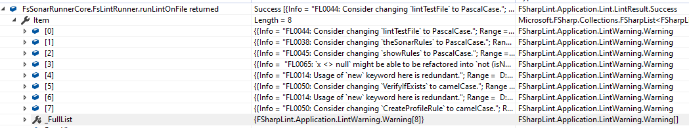
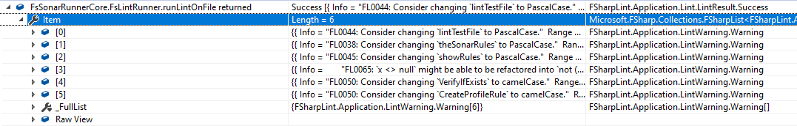

# Behaviour change regarding _Usage of `new` keyword redundant_

When updating _FSharp.Core_ from 4.6.2 to 4.7.0 the unit test breaks as the warning "FL0014: Usage of `new` keyword here is redundant." is no longer reported for classes instantiate a type which does not implement `IDisposable`.

The issue was reported at <https://github.com/dotnet/fsharp/issues/7876>

This example is reduced from [F# SonarQube community plugin](https://github.com/jmecsoftware/sonar-fsharp-plugin).

## Environment

- Visual Studio 2019 (16.3.9)
- .NET Core 3.0.100 (can also be reproduced with 2.2.100)
- FSharpLint 0.12.5

## Reproduction steps

If the single unit test is executed, the return value of `FsSonarRunnerCore.FsLintRunner.runLintOnFile` is

- with FSharp.Core 4.6.2 configured (branch master):

- when updated the nuget package to FSharp.Core 4.7.0 in both projects (branch fsharp470):

## Expected behavior

As only _FSharp.Core_ is updated no change of reported warnings by FSharpLint is expected.
